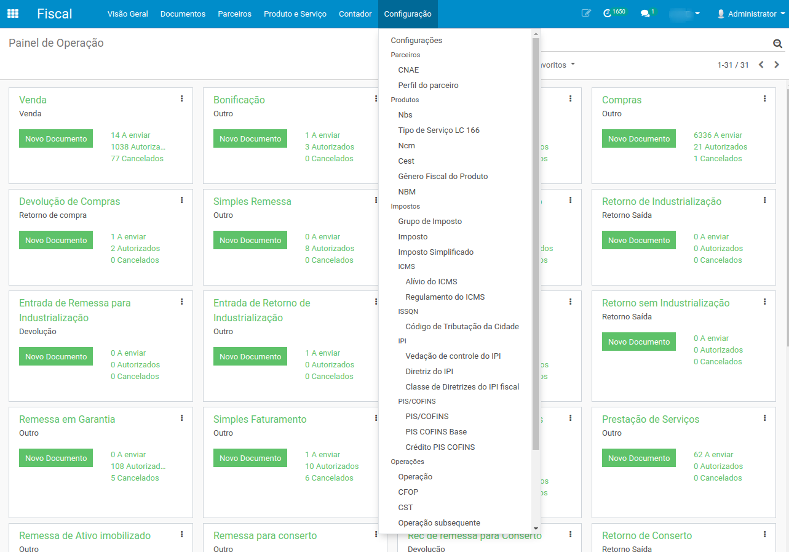
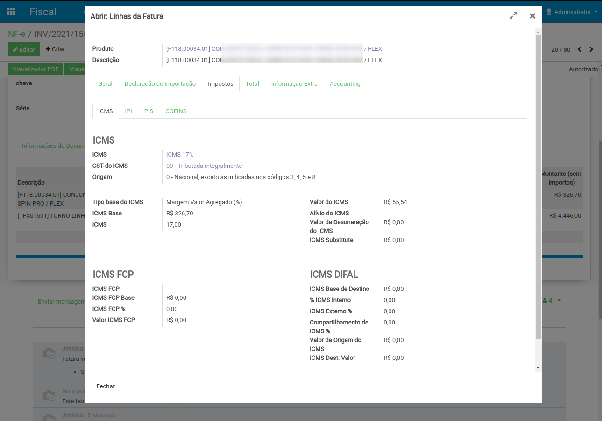
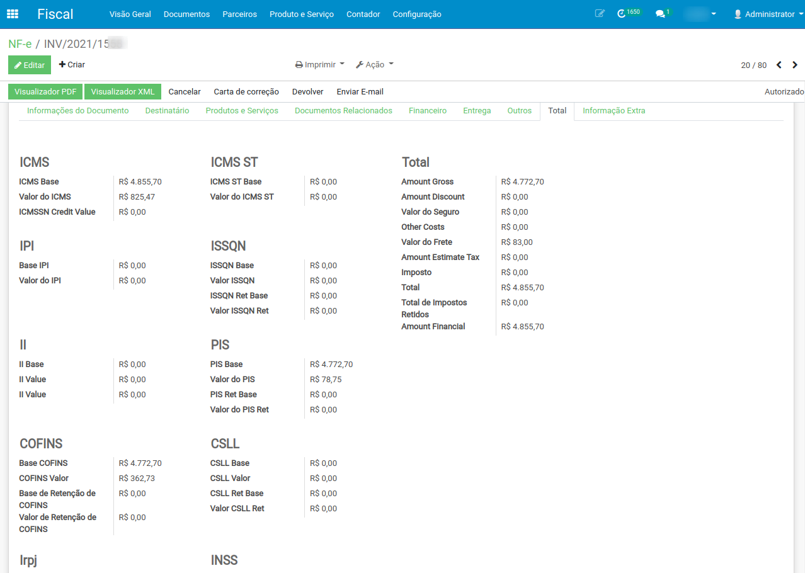
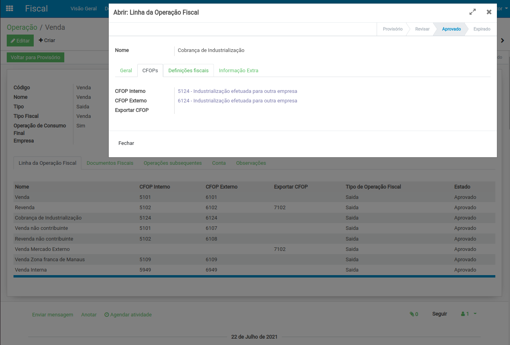

## Classificações fiscais

Primeramente, este módulo traz uma variedade de cadastros fiscais para
produtos, parceiros ou empresas. Na hora de emitir documentos fiscais
como NF-e, NFS-e etc... até empresas do regime simplificado ou MEI
precisam de vários desses cadastros. E empresas do regime normal
precisam deles para calcular os impostos ou emitir documentos fiscais.

Produtos:  
- tipo fiscal
- NCM (com ligações com os impostos)
- genêro fiscal
- CEST
- NBM
- NBS
- tipo de serviço
- unidades fiscais

Parceiros:  
- CNAE
- perfil fiscal

## Conceito de documento fiscal

O Odoo nativo não tem o conceito de documento fiscal. O conceito mais
parecido seria o `account.move` e até a versão 10.0 a localização
estendia o invoice para suportar as NF-e e NFS-e apenas. Naquela época
não era razoável você cogitar fazer o SPED no Odoo, o próprio core do
Odoo não tinha maturidade para isso então era válido a abordagem
empírica de ir suportando mais casos de NFe dentro do invoice Odoo
apenas.

Porém, na v12, amadurecemos o framework XML/SOAP de forma que se torna
razoável suportar vários documentos fiscais (NF-e, NFS-e, MDF-e, CT-e,
EFD-Reinf, e-Social, GNRE, BP-e...) com a qualidade OCA dentro do Odoo.
Também, apesar de complexo, o core do Odoo finalmente tem suporte
suficiente para as operações de uma empresa que faria o SPED.

Nisso se torna interessante ter o conceito de documento fiscal
`l10n_br_fiscal.document` independente do invoice Odoo para suportar
todos os documentos fiscais mesmo, de forma modular. Um outro motivo
para ter o conceito de documento fiscal fora do módulo account é que
quando você analisa o código deste módulo `l10n_br_fiscal`, quase nada
dele poderia ser feito pelo módulo account do Odoo. Então ter esse
módulo l10n_br_fiscal que não depende do módulo account também é uma
forma de modularizar a localização para facilitar a manutenção dela,
especialmente quando se trata de migrar e que o módulo pode ter mudado
bastante como foi o caso entre a v8.0 e a v9.0 ou a v12.0 e v13.0 por
exemplo. Facilita também a governança do projeto possibilitando que
pessoas sejam responsáveis por diferentes partes. O módulo
l10n_br_fiscal foi principalmente extraído do módulo
l10n_br_l10n_br_account_product das v7.0 as v.10.0.

Esse módulo `l10n_br_fiscal` é agnóstico de qualquer tecnologia XML ou
SOAP. Ele contém apenas o que há de comum entre os documentos fiscais
mas esses últimos são implementados em outros módulos. Para um
determinado documento fiscal como a Nf-e, você tem então por exemplo:

- `nfelib`: um pacote de data bindings puro Python (que não depende do
  Odoo). Em geral usamos um gerador de código para gerar esses bindings
  a partir dos esquemas XSD da fazenda.
- `l10n_br_nfe_spec`: um modulo de mixins Odoo geridos também a partir
  dos XSD. Esses mixins são apenas as estruturas de dados das
  especificações antes de ser injectados em objetos Odoo existantes
  (como res.partner ou l10n_br_fiscal.document) ou até tornados
  concretos caso não exite objetos na Odoo ou na OCA para eles já.
- `l10n_br_nfe`: um módulo Odoo que trata de injectar esses mappings
  fiscais nos objetos Odoo e que implementa a lógica como os wizards
  para a transmissão.

A transmissão é realizada usando uma lib de transmissão como
`erpbrasil.doc` (baseada em Python Zeep). Importante: no caso da
`NFS-e`, a ausência de padrão nacional hoje e a simplicidade do modelo
(comparado com a NFe) faz que foi decidido de não usar um módulo de
mixins fiscais Odoo geridos, o mapping é com a lib de binding é feito
manualmente, família de NFS-e por família.

Alem disso a maioria do codigo do `l10n_br_fiscal.document` e das linhas
dele `l10n_br_fiscal.document.line` é na verdade feito dentro de mixins
`10n_br_fiscal.document.mixin` e `10n_br_fiscal.document.line.mixin`
respectivamente. Esses mixins podem assim ser injectados em outros
objetos Odoo que precedem os documentos fiscais e podem armazenar então
o mesmo tipo de informação: `sale.order`, `purchase.order`,
`stock.picking`... Isso é bem visível nos módulos que estendem esse
módulo:

``` text
|-- l10n_br_fiscal
    |-- l10n_br_sale
    |-- l10n_br_purchase
    |-- l10n_br_account
    |-- ...
```

Porem o caso do invoice Odoo no modulo `l10n_br_account` é diferente
ainda. Pois já se tem a tabela independente do documento fiscal cuja
grande maioria das dezenas e até centenas de campos fiscais (no caso de
muitos tipos de documentos fiscais) não são redundante com os do invoice
Odoo. Se a gente injetasse esses mixins dentro do invoice, aí sim essas
centenas de campos seriam duplicados entre o invoice e o documento
fiscal. Por isso, o sistema que foi adotado no modulo `l10n_br_account`
é que um invoice Odoo passa a ter um
`_inherits = "l10n_br_fiscal.document"` de forma que se pilota o
documento fiscal através do invoice, oferecendo o mesmo tipo de
integração como antes. O mesmo tipo de mecanismo acontece com a linha do
documento fiscal.

Sendo assim, já pelos \_inherits, o invoice Odoo e as linhas dele já vão
puxar todos campos fiscais como se eles fossem das suas respectivas
tabelas sem duplicar eles no banco. Se alem disso a gente injetasse os
mixins `10n_br_fiscal.document.mixin` e
`10n_br_fiscal.document.line.mixin` no invoice e invoice.line, esses
campos fiscais apareceriam também nas tabelas `account_move` e
`account_move_line` de forma redundantes com os campos puxados pelos
\_inherits. Para não ter esse problema, os métodos fiscais comuns (sem
os campos) foram ainda extraidos nos mixins:
`10n_br_fiscal.document.mixin.methods` e
`10n_br_fiscal.document.line.mixin.methods` que são injectados nos
objetos `account_move` e `account_move_line` respectivamente dentro do
modulo `l10n_br_account`.

## Impostos brasileiros

O módulo l10n_br_fiscal lida com os principais impostos brasileiros
como:

- ICMS do Simples Nacional
- ICMS do Regime normal
- IPI
- PIS
- COFINS
- ISSQN
- IRPJ
- II
- CSLL
- INSS

O módulo l10n_br_fiscal também lida com:

- ST
- retenções





É notório que o cálculo dos impostos no Brasil é muito especial e muito
trabalhoso. Geralmente é o motivo pelo qual os ERPs internacionais não
tem grande fatia de mercado brasileiro.

Até a versão 10.0, tentamos usar e estender o objeto Odoo `account.tax`.
A Akretion até criou o projeto `OCA/account-fiscal-rule` para determinar
as alíquotas de cada imposto de accordo com os parâmetros da operação
fiscal. Porém, a gente acabava usando quase nada do
`account.fiscal.position` nativo na parte fiscal e pelo contrário, isso
nos obrigava a ter um registro `account.tax` para cada aliquota e nos
obrigava a manter centenas de taxas e dezenas de milhares de regras para
selecionar a "posição fiscal" Odoo que aplicaria as taxas corretas. E
você ainda tinha que gerir essas dezenas de milhares de regras para uma
determinada empresa do regime normal. Conclusão: era inviável nos
projetos menores de tentar se encaixa na lógica do Odoo para calcular os
impostos brasileiros.

Nisso criamos neste módulo os modelos de taxas que representam
exatamente o funcionamentos dos impostos brasileiros. Além dos cálculos,
esses modelos também nos servem a carregar as tabelas dos impostos. E
mais adiante, no módulo `l10n_br_account`, ligamos os objetos nativos
`account.tax` as alíquotas dos impostos brasileiros.

Claro esses modelos dos impostos atendem as empresas do regime normal,
mas é bom lembrar que até empresas do regime simplificado precisam
desses modelos para realizar as operações com ST (Substituição
Tributária)...

## Operações fiscais

> 

No Odoo nativo, o conceito mais parecido com a operação fiscal e o
`account.fiscal.position`. E ate a versão 10.0, era o que a gente usava.
Porém, a posição fiscal do Odoo não resolve muito os nossos problemas
pois:

- no Brasil se tem uma operação fiscal por linha de documento fiscal
- a posição fiscal do Odoo desconhece a lógica da parametrização fiscal
  brasileira
- já que puxamos o cadastro dos impostos no módulo l10n_br_fiscal fora
  do módulo account (sem depender dele), não temos ainda o objeto
  `account.fiscal.position` neste módulo.

Com tudo, optamos por criar um objeto `l10n_br_fiscal.operation` que faz
exactamente o que precisamos para o Brasil. Mais adiante, no módulo
`l10n_br_account` é realizado a integração entre a posição fiscal do
Odoo e essa operação fiscal.
