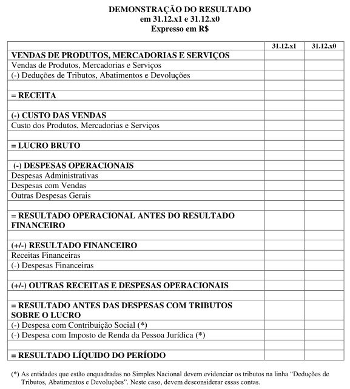

Este módulo implementa **Modelos de Relatórios Contábeis Brasileiros**, como o **Demonstrativo de Resultados do Exercício (DRE)** e o **Balanço Patrimonial (BP)**, baseados na norma **ITG 1000**. Ele permite que pequenas empresas e microentidades gerem relatórios contábeis de acordo com os padrões brasileiros, com a flexibilidade de personalizar os modelos conforme o plano de contas de cada empresa.

**Nota:** Embora esses modelos sejam **inspirados no ITG 1000**, eles **não correspondem exatamente ao modelo proposto pela norma**. Além disso, pode haver **diferenças** em relação às versões mais recentes do ITG 1000.

Para mais informações, consulte as [Normas Simplificadas para PMEs no site do CFC](https://cfc.org.br/tecnica/normas-brasileiras-de-contabilidade/normas-simplificadas-para-pmes/).

**Observação:** Esses modelos são um **ponto de partida** e precisam ser **ajustados** de acordo com o plano de contas da sua empresa. Por padrão, eles estão configurados com os prefixos das contas contábeis da **localização brasileira da OCA**. Para saber mais sobre como configurar corretamente esses modelos, consulte a **seção de configuração**.

#### Balanço Patrimonial (BP)

Abaixo está um exemplo visual de um **Balanço Patrimonial** inspirado no ITG 1000:

#### Demonstrativo de Resultados do Exercício (DRE)

Abaixo está um exemplo visual de um **DRE** (Demonstrativo de Resultados do Exercício) inspirado no ITG 1000:

